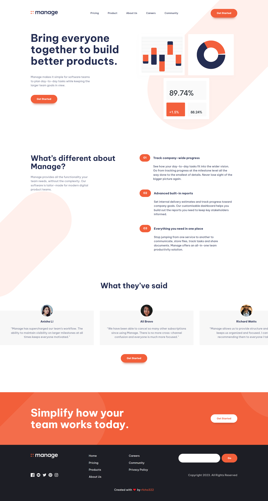

# Frontend Mentor Manage - A responsive product landing page

## Table of Contents

- [Overview](#overview)
  - [The Challenge](#overview)
  - [Screenshot](#screenshot)
  - [Links](#links)
- [How I developed it?](#how-i-developed-it)
  - [Built using](#built-using)
  - [Resources](#resources)
- [Author](#author)

## Overview
### The Challenge

Users should be able to:

- View the optimal layout for the site depending on their device's screen size
- See hover states for all interactive elements on the page
- See all testimonials in a horizontal slider
- Receive an error message when the newsletter sign up form is submitted if:
- The input field is empty
- The email address is not formatted correctly

### Screenshot

  
  

### Links
- Solution (Source Code): https://github.com/rfcho322/fem-manage
- Demo website: https://manage-rfcho322.netlify.app/

### How I developed it?

This was created using **HTML**, **CSS Grid**, a bit of **JavaScript** for the hamburger menu and **A11y slider** for product comments, tools like **Vite** for bundling and for rapid frontend development.

### Built using
- Semantic HTML5
- CSS custom properties
- CSS Flexbox
- CSS Grid
- BEM (“Block”, “Element”, “Modifier”)
- JavaScript

### Resources

- Vite: https://vitejs.dev/
- A11y Slider Library: https://a11yslider.js.org/ - works by using CSS scroll snapping. You can generate a slider by creating an overflowed container and then setting widths all via CSS. Media queries in your CSS will also update the slider.

## Author
- Frontend Mentor -[@rfcho322](https://www.frontendmentor.io/profile/rfcho322)

